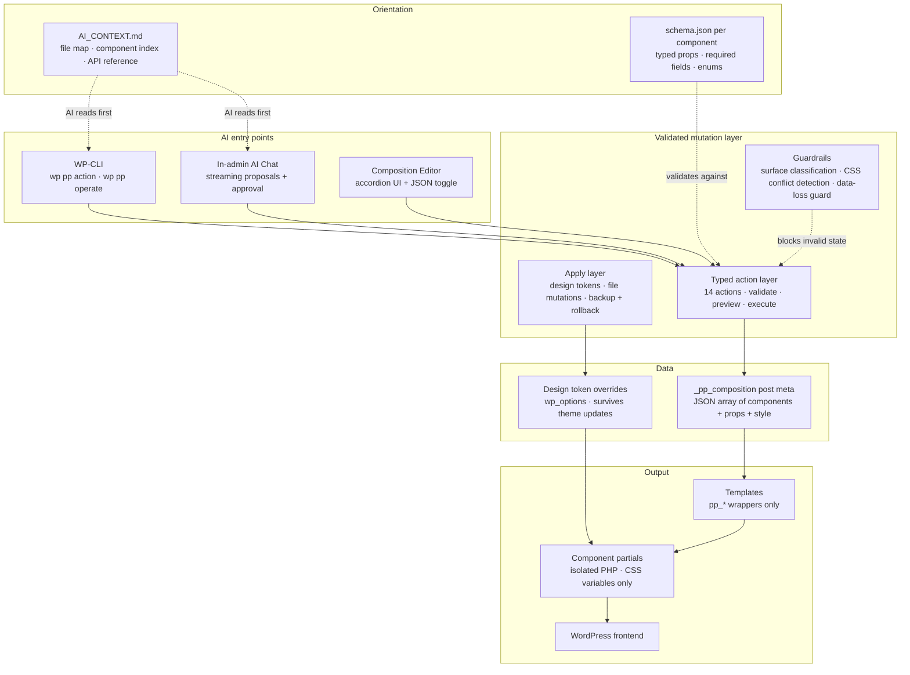

<div align="center">

# PromptingPress

### WordPress pages that AI agents can actually understand.

**A structured composition layer for WordPress. Pages are typed components + JSON data. Design lives in tokens. Every edit goes through a validated action layer. AI can inspect, propose, and apply changes through predictable interfaces — no reverse-engineering of theme clutter required.**

---

[](https://wordpress.org)
[](https://php.net)
[](https://developer.mozilla.org/en-US/docs/Web/JavaScript)
[](https://vitest.dev)
[](tests/)
[](CHANGELOG.md)
[](LICENSE)

</div>

---

## What PromptingPress does

Most WordPress themes store layout intent across theme files, block metadata, visual builder state, plugin abstractions, and settings pages. A human learns where things live over time. An AI agent re-infers everything from scratch on every session — and traditional WordPress gives it very little to work with.

**PromptingPress makes page structure explicit and machine-readable.** Pages are JSON arrays of typed components. Design rules are CSS custom properties. Every mutation goes through a validated action layer with preview and rollback. An AI agent can read `AI_CONTEXT.md`, understand the entire site, and make confident edits without knowing WordPress internals.

This is not a visual page builder. This is not a generic AI website builder. This is the structural layer that makes WordPress workable for AI-led page creation and maintenance.

---

## The old way vs. PromptingPress

| Traditional WordPress theme | PromptingPress |
|---|---|
| Layout scattered across blocks, builders, shortcodes, and theme options | Page layout is one JSON array in post meta — inspectable, diffable, version-controllable |
| Ad hoc theme files, no contracts on what a component accepts | Every component has a `schema.json` with typed props, required fields, and validation |
| `get_header()`, `the_content()`, `wp_nav_menu()` called from templates | Templates use `pp_*` wrappers only — `lib/wp.php` is the single WordPress contact surface |
| Colors and spacing set through visual overrides or inline CSS | 33 design tokens in one CSS file; site overrides stored in the database, survive theme updates |
| AI reads the codebase and guesses what's editable | AI reads `AI_CONTEXT.md` + component schemas and knows exactly what's editable and how |
| Changes via file edits, block editor, or plugin-specific APIs | Every change goes through one typed action layer — validate, preview, execute, rollback |

> **When page structure is explicit and every edit path is validated, AI stops guessing and starts operating.**

---

## How AI works with PromptingPress



**Every path from AI intent to rendered page goes through the same validated layer.** CLI, chat, and editor are different interfaces into one mutation system. Nothing bypasses validation. Nothing writes directly to files or post meta without going through the action model.

---

## What AI can safely work with

### Compositions — pages as structured data

Every page using the Composition template stores its layout in `_pp_composition` post meta:

```json
[
  { "component": "hero", "props": { "title": "Welcome", "variant": "centered" } },
  { "component": "section", "props": { "body": "<p>Content here.</p>" } },
  { "component": "grid", "props": { "items": [
    { "title": "Fast", "text": "Lightning speed." },
    { "title": "Safe", "text": "Enterprise security." }
  ] } }
]
```

No blocks. No shortcodes. No visual-builder serialization. AI can read, write, diff, and version-control compositions like any other structured data. Semantic selectors let AI target specific fields by name (`hero.subtitle`, `grid[title="Features"].items[title="Speed"].text`) instead of fragile array indices.

**Why this matters:** An AI agent can inspect a page, understand exactly what's editable, propose a change with preview, and apply it — in one session, without prior WordPress knowledge.

---

### Typed components — contracts, not conventions

11 components, each isolated in its own directory with a `schema.json`:

| Component | Purpose | Key props |
|-----------|---------|-----------|
| hero | Full-width headline with optional CTA, image, overlay | `title` |
| section | Text + optional image, 3 layout variants (default, dark, centered) | `body` |
| grid | Responsive card grid with theme variants (default, dark, steps) | `items[]` |
| faq | Native `details/summary` accordion, zero JavaScript | `items[]` |
| cta | Call-to-action block with layout, color axis, and background image | `title`, `button_text`, `button_url` |
| stats | Large-number metrics with labels and optional background image | `items[]` |
| logos | Flex-wrap image strip for partner/client logos | `items[]` |
| table | Data/comparison table, horizontal scroll on mobile | `headers[]`, `rows[][]` |
| embed | WordPress shortcode / plugin content wrapper | `content` |
| nav | Site header with hamburger mobile nav | -- |
| footer | Site footer with nav menu and copyright | -- |

The auto-loader picks up any new component at `/components/{name}/{name}.php` — drop a file, add a schema, it works. No registration code.

**Why this matters:** AI doesn't have to guess what props a component accepts, which are required, or what values are valid. The schema is the contract. Invalid compositions are rejected before they reach the database.

---

### Design tokens — visual system without file edits

33 CSS custom properties control the entire visual system: colors, typography, spacing, borders, measures. Product defaults live in `assets/css/base.css`. Site-specific overrides are stored in the database and **survive theme updates** — no file to lose when the theme ZIP gets replaced.

58 per-instance style slots let AI make this page's hero dark and spacious while that page's hero is tight and accent-bordered — all through composition data, no CSS edits. 10 named recipes (like `dark-spacious` or `compact`) expand to multiple slot values at once.

```bash
# Preview a token change without applying
wp pp apply preview update_design_token \
  --params='{"token":"--color-accent","value":"#b45309"}'

# Apply with automatic backup
wp pp apply execute update_design_token \
  --params='{"token":"--color-accent","value":"#b45309"}'
```

**Why this matters:** An AI agent can retheme an entire site by updating 33 tokens — with preview, backup, and rollback on every change. No CSS files to parse, no specificity wars, no visual editor toggles to find.

---

### WP abstraction layer — WordPress knowledge not required

`lib/wp.php` is the only file that calls WordPress functions directly. Every template and component uses `pp_*` wrappers. The entire WordPress dependency surface is one file.

| Instead of | AI writes |
|---|---|
| `get_the_title()` | `pp_title()` |
| `get_post_meta($id, '_pp_composition', true)` | `pp_get_composition($id)` |
| `wp_nav_menu(...)` | `pp_nav_menu($location)` |
| `the_content()` | `pp_content()` |

**Why this matters:** AI can edit templates and components without learning WordPress's function signature jungle. Templates are also testable without bootstrapping WP — the abstraction layer mocks cleanly.

---

### Action/apply layer — one validated write path

Every mutation — from CLI, from AI chat, from the editor — goes through the same typed action system:

```bash
# See all 14 available actions
wp pp action list

# Preview what a change would do (dry run, never writes)
wp pp action preview add_component \
  --params='{"post_id":74,"component":"section","props":{"body":"<p>New.</p>"}}'

# Execute with validation
wp pp action execute add_component \
  --params='{"post_id":74,"component":"section","props":{"body":"<p>New.</p>"}}'
```

14 typed actions cover page lifecycle, composition edits, component operations, styling, and site options. The apply layer handles design token and file mutations with automatic backup (keeps last 5), post-write contract verification, and auto-restore on failure.

**Why this matters:** AI agents can't accidentally produce invalid state. The system validates inputs, shows a preview diff, and rolls back on failure — all through the same interface regardless of how the edit was initiated.

---

### AI chat — structured proposals, not raw text

An in-admin chat at PromptingPress > AI Chat. The AI reads your real site state — pages, compositions, media library, design tokens — and proposes changes as structured mutation cards with Apply/Cancel buttons.

Multi-step proposals show numbered steps with "Apply All." After applying, the AI knows about its own changes and can build on them in the same conversation. Streaming via SSE. Supports Anthropic, Google, and OpenAI through WordPress 7.0 Connectors.

**Why this matters:** The AI doesn't generate raw code and hope it works. It proposes typed actions through the same validated layer that CLI and the editor use. Every proposal is previewable and reversible.

---

### Agent operating framework — safety-gated autonomous work

For AI agents running autonomously: an 8-step operating loop with enforcement.

**INSPECT** > **PLAN** > **EDIT** > **PREFLIGHT** > **APPLY** > **SCREENSHOT** > **REVIEW** > **HANDOFF**

Run tokens (UUID v4 state files) enforce step ordering — an agent can't apply without inspecting first, can't execute a file mutation without passing preflight. Drift detection compares live theme files against the last sync. Three playbooks ship for common operations: create-page, revise-section, inspect-fix.

**Why this matters:** Autonomous agents can operate on live sites without skipping safety checks. The framework catches the "I'll just write the file directly" shortcut before it does damage.

---

## Example workflow

**Scenario:** An AI agent adds a features section to an existing landing page.

```
1. Agent reads AI_CONTEXT.md
   → learns: 11 components, schema contracts, action layer, composition format

2. Agent inspects the page
   $ wp pp operate inspect-composition 74
   → sees: hero at [0], section at [1], cta at [2] — with every editable field listed

3. Agent chooses the grid component (from schema: items[] with title, text, image_url)
   and builds the composition patch

4. Agent previews the change
   $ wp pp action preview add_component --params='{...}'
   → sees: diff showing grid inserted at position 2, cta shifted to [3]

5. Agent executes
   $ wp pp action execute add_component --params='{...}'
   → validated, written to _pp_composition, confirmed

6. Page renders through WordPress with the new grid section
```

No theme files were edited. No WordPress internals were called. No visual builder state was generated. The composition changed; the page reflects it.

---

## Architecture

```
/components/{name}/        Component partials + schema.json
/templates/                Page layout files (pp_* wrappers only)
/lib/wp.php                WP abstraction layer
/lib/actions.php           Typed action model (14 actions)
/lib/apply.php             Apply layer (file + option mutations, backup/rollback)
/lib/operate.php           Operating loop: inspect, preflight, run tokens
/lib/cli.php               WP-CLI commands (wp pp action · apply · check · integrity)
/lib/admin.php             Composition editor (accordion + CodeMirror + preview)
/lib/ai-chat.php           AI chat admin page + AJAX handlers
/lib/ai-context.php        AI system prompt assembly (site state, media, tokens)
/lib/ai-provider.php       LLM provider proxy (streaming + non-streaming)
/lib/guardrails.php        Surface classification, CSS conflicts, integrity checks
/lib/setup.php             Theme activation, homepage provisioning, integrity hooks
/lib/components.php        Component auto-loader (stable contract — don't edit)
/assets/css/base.css       Design token defaults (33 CSS variables)
/assets/css/components.css Component styles (CSS variables only, no raw hex)
/ai-instructions/          Task-specific AI workflow guides (13 files)
AI_CONTEXT.md              Machine-readable site map — AI starts here
AI_RULES.md                Hard coding invariants
```

---

## Quick start

### Requirements

- WordPress 7.0+
- PHP 8.0+
- No build step — vanilla PHP, CSS, and JS

### Installation

```bash
cd wp-content/themes/
git clone https://github.com/FJCF76/PromptingPress.git promptingpress
```

Activate the theme in Appearance > Themes. On activation, PromptingPress creates a Home page with the Composition template and assigns it as the static front page.

### AI chat setup

Configure an LLM provider in Settings > Connectors (WordPress 7.0 Connectors API — Anthropic, Google, or OpenAI). Then open PromptingPress > AI Chat.

### First CLI session

```bash
# See what's available
wp pp action list

# Create a new page
wp pp action execute create_page --params='{"title":"About Us"}'

# Inspect what's editable
wp pp operate inspect-composition 74

# Patch a single field by name
wp pp operate patch 74 --target=hero.subtitle --value="New Headline" --preview

# Retheme — preview a color change
wp pp apply preview update_design_token \
  --params='{"token":"--color-accent","value":"#b45309"}'

# Check theme file integrity after deployment
wp pp integrity check
```

---

## Architectural rules

Enforced by `AI_RULES.md` and verified by automated tests:

- Templates call components. Components do not call components.
- No WordPress functions in `/templates/` or `/components/`. Only `lib/wp.php` calls WP.
- No hooks (`add_action`, `add_filter`) in view files. Only in `functions.php`.
- No raw hex values in `components.css` — CSS variables from `base.css` only.
- Every component ships with a `schema.json`.

---

## Tests

**572 PHP tests, 2158 assertions** — component loader, WP abstraction, schema validation, 14 typed actions, apply layer, AI context, proposal parsing, style slots, surface classification, font management, integrity, operating loop:

```bash
composer install && composer test
```

**141 JS tests** — JSON context, composition validator, accordion data, insert position, data-loss guard, DOM selector alignment, CSS lint, packaging:

```bash
npm install && npm test
```

**7 E2E tests** — full composition editor round-trip against a live WordPress instance (requires Docker):

```bash
npm run env:start   # boot wp-env container
npm run test:e2e    # Playwright against http://localhost:8889
npm run env:stop
```

---

## Project status

PromptingPress is in active development by a single developer. It is not yet packaged for broad distribution. The current focus is making the AI-agent workflow reliable and the composition model complete.

See [CHANGELOG.md](CHANGELOG.md) for a detailed release history from v0.0.1 through v0.8.1.

**What exists today (v0.8.1):**
- 11 components with schema contracts and 58 per-instance style slots
- Typed action/apply layer with validation, preview, and rollback
- Semantic composition patching — target fields by name, not index
- In-admin AI chat with structured mutation proposals
- Agent operating framework with step enforcement and drift detection
- WP-CLI interface for all operations
- 720+ automated tests across PHP, JS, and E2E
- Theme integrity checking with build manifests

See [open issues](https://github.com/FJCF76/PromptingPress/issues) for planned work.

---

## License

GPL-2.0-or-later. See [LICENSE](LICENSE).

---

<div align="center">

**PromptingPress** — Structured WordPress for AI agents.

*Built with [WordPress](https://wordpress.org) + [Vitest](https://vitest.dev) + [Playwright](https://playwright.dev)*

</div>
