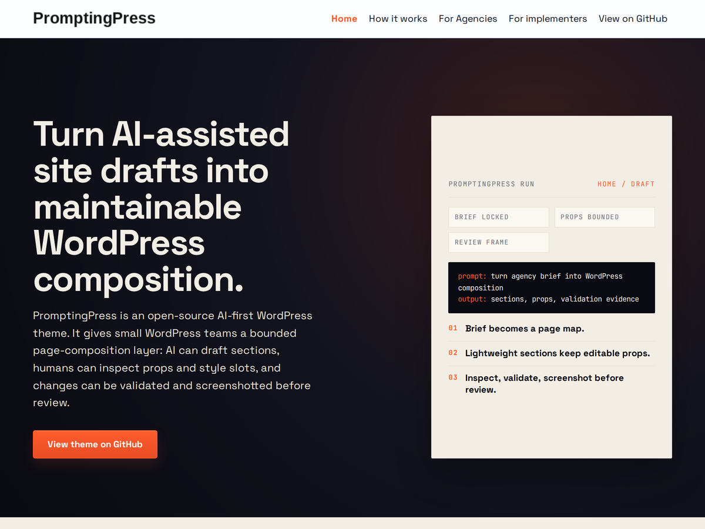
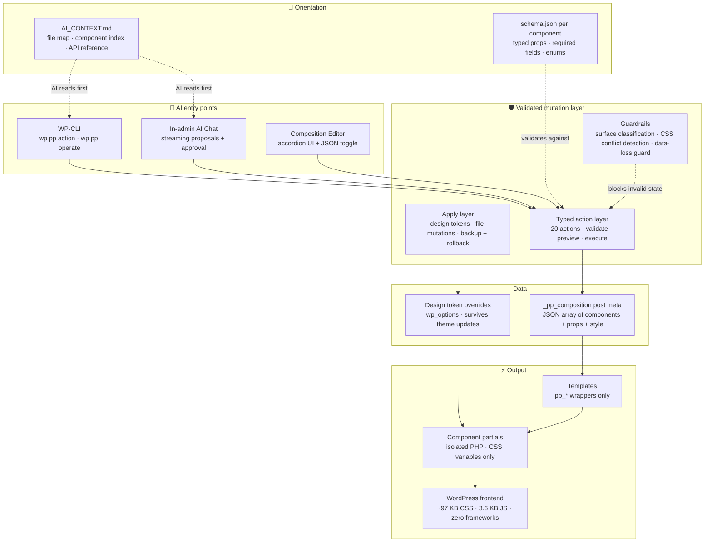

<div align="center">

# PromptingPress

### WordPress pages that AI agents can understand — and fast sites that skip the builder bloat.

**A lightweight composition layer for WordPress. Pages are typed components + structured JSON. Design lives in tokens. The frontend ships ~97 KB of CSS and 3.6 KB of vanilla JS — no framework, no bundler, no builder runtime. AI can inspect, edit, and maintain pages through predictable interfaces instead of reverse-engineering theme clutter.**

---

[](https://wordpress.org)
[](https://php.net)
[](https://developer.mozilla.org/en-US/docs/Web/JavaScript)
[](https://vitest.dev)
[](tests/)
[](CHANGELOG.md)
[](LICENSE)

</div>

---

<p align="center"></p>

## ⚡ Fast, structured WordPress without builder bloat

Most visual builders solve human editing by adding hidden state, heavy abstractions, serialized layouts, and frontend overhead. Pages get harder for AI to reason about — and slower than they need to be.

PromptingPress goes the other direction:

- **Explicit composition data** — pages are JSON arrays, not serialized builder state
- **Typed components with schemas** — AI knows what's editable and what values are valid
- **File-owned design rules** — design tokens in one CSS file, no visual overrides to hunt down
- **Minimal frontend assumptions** — no framework, no bundler, no builder runtime on the visitor-facing site
- **Fast, maintainable WordPress output** — the architecture is designed to stay lean

> **The same design that makes pages AI-editable also makes them fast. Structured data and isolated components have no runtime overhead to carry.**

---

## 📖 Contents

- [Why PromptingPress](#-fast-structured-wordpress-without-builder-bloat) · [Comparison](#-the-old-way-vs-promptingpress)
- [**Quick start**](#-quick-start) — requirements, install, AI chat setup, first CLI session
- [How AI works with it](#-how-ai-works-with-promptingpress) · [The operating model](#-the-operating-model) · [Example workflow](#-example-workflow)
- [Architecture](#%EF%B8%8F-architecture) · [Architectural rules](#-architectural-rules) · [Tests](#-tests)
- [Documentation](#-documentation) · [Project status](#-project-status) · [License](#license)

---

## 🔄 The old way vs. PromptingPress

| | Traditional WordPress theme | PromptingPress |
|---|---|---|
| 🧠 **AI readability** | AI reads the codebase and guesses what's editable | AI reads `AI_CONTEXT.md` + component schemas and knows exactly what's editable and how |
| 🧩 **Page structure** | Layout scattered across blocks, builders, shortcodes, and theme options | Page layout is one JSON array in post meta — inspectable, diffable, version-controllable |
| 🛡️ **Edit safety** | Changes via file edits, block editor, or plugin-specific APIs | Every change goes through one typed action layer — validate, preview, execute, rollback |
| 🪶 **Frontend weight** | Builder runtime, serialized markup, framework dependencies | ~97 KB CSS + 3.6 KB vanilla JS. No framework. No bundler. No builder runtime. |
| 🎨 **Design control** | Colors and spacing set through visual overrides or inline CSS | Design tokens in one CSS file; site overrides in the database, survive theme updates |
| 📄 **Component contracts** | Ad hoc theme files, no contracts on what a component accepts | Every component has `schema.json` with typed props, required fields, and validation |

> **When page structure is explicit and every edit path is validated, AI stops guessing and starts operating — and the frontend stays lean.**

---

## 🚀 Quick start

### Requirements

- WordPress 7.0+
- PHP 8.0+
- No build step — vanilla PHP, CSS, and JS

### Installation

1. Download the latest release ZIP from [GitHub Releases](https://github.com/FJCF76/PromptingPress/releases/latest)
2. In WordPress admin: **Appearance → Themes → Add New → Upload Theme**
3. Upload the ZIP file and activate PromptingPress

On activation, PromptingPress creates a Home page with the Composition template and assigns it as the static front page.

> ℹ️ **WP-Cron dependency:** "Add New Page" creates a hidden `auto-draft` placeholder that WordPress cleans up (`wp_delete_auto_drafts()`) roughly 7 days later — but only when WP-Cron actually fires, which is driven by site traffic. On an install with `DISABLE_WP_CRON` set, or very low traffic (plausible for an internal admin tool), abandoned auto-drafts can accumulate silently. They stay hidden from the Pages list, so this is harmless housekeeping, not data risk. If it matters for your install, hit `wp-cron.php` from a real system cron. This mirrors WordPress core's own new-post flow.

<details>
<summary><strong>Developer install (clone the repo)</strong></summary>

```bash
cd wp-content/themes/
git clone https://github.com/FJCF76/PromptingPress.git promptingpress
```

This gives you the full repo with tests, dev tooling, and git history. Useful for contributing, inspecting source, or running the test suite locally.

</details>

### AI chat setup

Configure an LLM provider in Settings > Connectors (WordPress 7.0 Connectors API — Anthropic, Google, or OpenAI). Then open PromptingPress > AI Chat.

### 🔧 First CLI session

```bash
# See what's available
wp pp action list

# Create a new page
wp pp action execute create_page --params='{"title":"About Us"}'

# Read a component's contract: props, style slots, conditions, recipes
wp pp schema hero

# Inspect what's editable
wp pp operate inspect-composition --post_id=74

# Patch a single field by name
wp pp operate patch --post_id=74 --target=hero.subheading --value="New Headline" --preview

# Retheme — preview a color change
wp pp apply preview update_design_token \
  --params='{"token":"--color-accent","value":"#b45309"}'

# Check theme file integrity after deployment
wp pp integrity check
```

---

## 🔧 How AI works with PromptingPress



**Every path from AI intent to rendered page goes through the same validated layer.** CLI, chat, and editor are different interfaces into one mutation system. Nothing bypasses validation. The output is plain WordPress — fast, cacheable, no builder runtime.

---

## 🧩 The operating model

### 🧠 Compositions — pages as structured data

Every page using the Composition template stores its layout in `_pp_composition` post meta:

```json
[
  { "component": "hero", "props": { "title": "Welcome", "layout": "centered" } },
  { "component": "section", "props": { "body": "<p>Content here.</p>" } },
  { "component": "grid", "props": { "items": [
    { "title": "Fast", "text": "Lightning speed." },
    { "title": "Safe", "text": "Enterprise security." }
  ] } }
]
```

No blocks. No shortcodes. No visual-builder serialization. AI can read, write, diff, and version-control compositions like any other structured data. Semantic selectors let AI target specific fields by name (`hero.subheading`, `grid[title="Features"].items[title="Speed"].text`) instead of fragile array indices.

**Why this matters:** An AI agent can inspect a page, understand exactly what's editable, propose a change with preview, and apply it — in one session, without prior WordPress knowledge.

---

### 🧩 Typed components — contracts, not conventions

12 components, each isolated in its own directory with a `schema.json`. Ten of them are composable — a page places them:

| Component | Purpose | Key props |
|-----------|---------|-----------|
| hero | Full-width headline with optional CTA, image, overlay | `title` |
| section | Text + optional image or content panel; 5 `layout`s (text-only, image-left, image-right, centered, text-panel) + `theme` (default, muted, inverted) | one of `body` / `body_items` / panel content |
| grid | Responsive card grid; `layout` (cards, steps) + `theme` (default, muted, inverted) + `card_emphasis` (featured, uniform) + `columns` (1-4, force desktop column count) + `image_treatment` (banner, icon) | `items[]` |
| faq | Native `details/summary` accordion, zero JavaScript | `items[]` |
| cta | Call-to-action block with layout, color axis, and background image; `title` optional (omit for a standalone button row); optional second button for a primary + secondary pair | `button_text`, `button_url` |
| stats | Large-number metrics with labels and optional background image | `items[]` |
| logos | Flex-wrap image strip for partner/client logos | `items[]` |
| table | Data/comparison table, horizontal scroll at any viewport | `headers[]`, `rows[][]` |
| embed | WordPress shortcode / plugin content wrapper | `content` |
| testimonials | Customer quotes with attribution — card grid or single-column stack | `items[]` |

Two more components ship with the theme but are **not composable**: `nav` and `footer` are site chrome, rendered on every page by the base template. Putting either into a page composition renders the header or footer twice, so the write is rejected with `template_owned_component`. Set the site logo through the `pp_logo_id` option and the menus through the menu actions; `pp_logo_alt` overrides the logo's alt text on both chrome logos when it should differ from the attachment's own alt metadata (unset, the alt falls back to that metadata and then the site title, so it is never empty). The footer's dark-marketing chrome (background/text/link colors, brand blurb, contact block, custom copyright) is set through the `pp_footer_*` site options, and the header's (background/text/link colors) through the `pp_header_*` options. The footer can also be organised through the same surface: `pp_footer_menu_label` / `pp_footer_contact_label` label its columns, `pp_footer_note` moves the copyright into a delimited bottom bar with a secondary line, and `pp_footer_logo_id` gives it a light logo variant that overrides `pp_logo_id` on the footer only. A second footer menu column (e.g. a distinct Legal column) renders when a menu is assigned to the `footer_secondary` theme location; `pp_footer_secondary_label` is its optional heading, and with no menu assigned the footer is unchanged. A social-icon row is set through `pp_footer_social` — a JSON list of `{network, url}` from a closed set of known networks (x, linkedin, facebook, instagram, youtube, github, tiktok, mastodon) — rendered as accessible inline-SVG icon links under the brand blurb. The two background options — `pp_header_bg` and `pp_footer_bg` — accept a bounded CSS gradient as well as a plain color, so a dark or gradient marketing header/footer is expressible without touching the site's global tokens.

The auto-loader picks up any new component at `/components/{name}/{name}.php` — drop a file, add a schema, it works. No registration code.

**Why this matters:** AI doesn't have to guess what props a component accepts, which are required, or what values are valid. The schema is the contract. Invalid compositions are rejected before they reach the database.

---

### 🪶 Lightweight rendering — no builder runtime on the frontend

Components are plain PHP partials that render semantic HTML with CSS custom properties. No React. No Vue. No jQuery. No builder framework. No shortcode parser. The visitor-facing site loads:

| Asset | Size | What it does |
|-------|------|-------------|
| `base.css` | 9 KB | Design tokens — CSS custom properties |
| `components.css` | 84 KB | All 12 component styles, CSS variables only |
| `utilities.css` | 3 KB | Layout helpers |
| `main.js` | 9.5 KB | Hamburger nav toggle (disclosure panel + close-icon swap), dropdown-submenu disclosures, and sticky-header height measurement — one IIFE, zero dependencies |

No build step. No transpilation. No bundler. What you write is what ships.

**Why this matters:** The same architecture that makes pages easy for AI to understand also keeps the frontend lean. Structured data and isolated PHP components don't carry runtime overhead. Pages load fast because there's nothing unnecessary to load.

---

### 🎨 Design tokens — visual system without file edits

A single layer of CSS custom properties controls the entire visual system: colors, typography (including mono/meta/label/kicker roles), spacing, borders, shadows, measures. Product defaults live in `assets/css/base.css`. Site-specific overrides are stored in the database and **survive theme updates** — no file to lose when the theme ZIP gets replaced.

261 per-instance style slots let AI make this page's hero dark and spacious while that page's hero is tight, accent-bordered, and lifted with a drop shadow — all through composition data, no CSS edits. 11 named recipes (like `dark-spacious` or `compact`) expand to multiple slot values at once.

```bash
# Preview a token change without applying
wp pp apply preview update_design_token \
  --params='{"token":"--color-accent","value":"#b45309"}'

# Apply with automatic backup
wp pp apply execute update_design_token \
  --params='{"token":"--color-accent","value":"#b45309"}'
```

**Why this matters:** An AI agent can retheme an entire site by updating design tokens — with preview, backup, and rollback on every change. No CSS files to parse, no specificity wars, no visual editor toggles to find.

---

### 🛡️ Validated action/apply layer — one write path

Every mutation — from CLI, from AI chat, from the editor — goes through the same typed action system:

```bash
# See all 20 available actions
wp pp action list

# Preview what a change would do (dry run, never writes)
wp pp action preview add_component \
  --params='{"post_id":74,"component":"section","props":{"body":"<p>New.</p>"}}'

# Execute with validation
wp pp action execute add_component \
  --params='{"post_id":74,"component":"section","props":{"body":"<p>New.</p>"}}'
```

20 typed actions cover page lifecycle, composition edits, component operations, styling, navigation menus, SEO metadata, and site options. The apply layer handles design token and file mutations with automatic backup (keeps last 5), post-write contract verification, and auto-restore on failure.

**Why this matters:** AI agents can't accidentally produce invalid state. The system validates inputs, shows a preview diff, and rolls back on failure — all through the same interface regardless of how the edit was initiated.

---

### 🧭 AI_CONTEXT.md — orientation in seconds

`AI_CONTEXT.md` is a machine-readable site map: file responsibilities, component index, WP abstraction API, composition format, design tokens, mutation surfaces, and coding rules. An AI agent reads one file and knows the entire system — what's editable, how to edit it, and what constraints apply.

`lib/wp.php` is the only file that calls WordPress functions directly. Every template and component uses `pp_*` wrappers:

| Instead of | AI writes |
|---|---|
| `get_the_title()` | `pp_title()` |
| `get_post_meta($id, '_pp_composition', true)` | `pp_get_composition($id)` |
| `wp_nav_menu(...)` | `pp_nav_menu($location)` |
| `the_content()` | `pp_content()` |

**Why this matters:** AI can edit templates without learning WordPress's function signature jungle. The abstraction layer also means templates are testable without bootstrapping WordPress.

---

### 💬 AI chat — structured proposals, not raw text

An in-admin chat at PromptingPress > AI Chat. The AI reads your real site state — pages, compositions, media library, design tokens — and proposes changes as structured mutation cards with Apply/Cancel buttons.

Multi-step proposals show numbered steps with "Apply All." After applying, the AI knows about its own changes and can build on them in the same conversation. It also learns when a proposal is **refused**: a rejected step's error code, the composition band that blocked it, and the validator's message go back into the conversation, so you no longer retype a validation error to get it corrected. The retry stays yours — the failed card offers an **Ask the AI to fix it** button and nothing is sent until you click it. Streaming via SSE. Supports Anthropic, Google, and OpenAI through WordPress 7.0 Connectors.

**Why this matters:** The AI doesn't generate raw code and hope it works. It proposes typed actions through the same validated layer that CLI and the editor use. Every proposal is previewable and reversible.

---

### 🔌 WordPress MCP and agent-access layers

PromptingPress is designed to complement agent-access layers like the [WordPress MCP Adapter](https://github.com/WordPress/mcp-adapter), not replace them. MCP can expose WordPress capabilities to an external agent; PromptingPress gives that agent a structured frontend composition surface to inspect and maintain.

A practical MCP-ready loop looks like this:

1. The agent uses WordPress/MCP access to discover the site, pages, and available tools.
2. The agent reads `AI_CONTEXT.md` and component `schema.json` files to understand the PromptingPress contract.
3. For page changes, the agent uses `wp pp operate inspect-composition` and typed `wp pp action preview` commands instead of editing theme files.
4. After a human approves the plan, the agent executes through the same validated action layer used by CLI, chat, and the editor.
5. The agent captures screenshots and hands back evidence before the change is treated as done.

This is not a claim that PromptingPress ships a dedicated MCP server today. The point is narrower and more useful: when WordPress gives agents a cleaner access path, PromptingPress gives those agents a safer page-composition model to operate.

---

### 🔒 Agent operating framework — safety-gated autonomous work

The intended operator is an autonomous coding agent (Claude Code or similar) with
shell + WP-CLI access, typically over SSH to a VPS. It changes the site through an
8-step loop instead of editing files:

**INSPECT** → **PLAN** → **PREFLIGHT** → **EDIT** → **APPLY** → **SCREENSHOT** → **REVIEW** → **HANDOFF**

Run tokens (UUID v4 run state, stored per-run in the options table) enforce ordering on the `wp pp` surface: `action execute` refuses to run before INSPECT, and every DB-backed mutation (`action execute`, `operate patch`, `apply execute`) refuses to run before a PREFLIGHT covering its target — a specific `post_id` for page edits, or a site-scoped preflight for site/token changes. One deliberate exception since 1.16.14 (#767): a page whose stored composition is already classified corrupt cannot be preflighted at all (`apply preflight` fails closed on it), so requiring coverage made it unrepairable from the CLI; `update_composition` and `restore_composition` — and only those two, and only on that classification — are admitted without it, still fully validated. Every mutating command fails without a `--run-id`. Preflight classifies off-limits (core) files and blocks the apply; screenshots plus a checklist produce visual evidence; HANDOFF is the report you review. Three playbooks ship: create-page, revise-section, inspect-fix.

**What this is and isn't:** safety-gated autonomous operation, not permissionless
self-modification. The loop makes the structured path the easy one and catches the
"I'll just write the file directly" shortcut (preflight surface classification plus
integrity drift detection). It does **not** sandbox the shell — a raw `wp eval` or a
text-editor file edit still runs. The safe posture: point the agent at a dev
install, require it to work through `wp pp`, and gate production on a human reading
the HANDOFF report.

→ How to prompt your agent to use it safely: [docs/running-an-ai-agent.md](docs/running-an-ai-agent.md)
→ Why a DB write can't land before the safety gate (the design): [docs/operating-loop-safety.md](docs/operating-loop-safety.md)
→ Every `wp pp apply` command, flag, and error (reference): [docs/reference-apply-cli.md](docs/reference-apply-cli.md)
→ Apply a token change and roll it back, step by step (how-to): [docs/howto-apply-and-rollback.md](docs/howto-apply-and-rollback.md)

---

## 📋 Example workflow

**Scenario:** An AI agent adds a features section to an existing landing page.

```
1. Agent reads AI_CONTEXT.md
   → learns: 12 components, schema contracts, action layer, composition format

2. Agent inspects the page
   $ wp pp operate inspect-composition --post_id=74
   → sees: hero at [0], section at [1], cta at [2] — with every editable field listed

3. Agent chooses the grid component (from schema: items[] with title, text, image_url)
   and builds the composition patch

4. Agent previews the change
   $ wp pp action preview add_component --params='{...}'
   → sees: diff showing grid inserted at position 2, cta shifted to [3]

5. Agent executes
   $ wp pp action execute add_component --params='{...}'
   → validated, written to _pp_composition, confirmed

6. Page renders through WordPress with the new grid section
   → plain HTML + CSS custom properties, no builder runtime
```

No theme files were edited. No WordPress internals were called. No visual builder state was generated. The composition changed; the page reflects it — fast.

---

## 🏗️ Architecture

```
/components/{name}/        Component partials + schema.json
/templates/                Page layout files (pp_* wrappers only)
/lib/wp.php                WP abstraction layer
/lib/actions.php           Typed action model (20 actions)
/lib/apply.php             Apply layer (file + option mutations, backup/rollback)
/lib/operate.php           Operating loop: inspect, preflight, run tokens
/lib/cli.php               WP-CLI commands (wp pp action · apply · operate · schema · check · validate · integrity · screenshot · target · sync)
/lib/admin.php             Composition editor (accordion + CodeMirror + preview)
/lib/ai-chat.php           AI chat admin page + AJAX handlers
/lib/ai-context.php        AI system prompt assembly (site state, media, tokens)
/lib/ai-provider.php       LLM provider proxy (streaming + non-streaming)
/lib/post-apply-validate.php Post-apply DOM validation (images, content, component count)
/lib/guardrails.php        Surface classification, CSS conflicts, integrity checks
/lib/setup.php             Theme activation, homepage provisioning, integrity lifecycle (daily cron + pre-update block)
/lib/components.php        Component auto-loader (stable contract — don't edit)
/assets/css/base.css       Design token defaults
/assets/css/components.css Component styles (CSS variables only, no raw hex)
/ai-instructions/          Task-specific AI workflow guides
AI_CONTEXT.md              Machine-readable site map — AI starts here
AI_RULES.md                Hard coding invariants
```

---

## 📏 Architectural rules

Enforced by `AI_RULES.md` and verified by automated tests:

- Templates call components. Components do not call components.
- No WordPress functions in `/templates/` or `/components/`. Only `lib/wp.php` calls WP.
- No hooks (`add_action`, `add_filter`) in view files. Only in `functions.php`.
- No raw hex values in `components.css` — CSS variables from `base.css` only.
- Every component ships with a `schema.json`.

---

## ✅ Tests

**PHP unit tests** — component loader, WP abstraction, schema validation, 20 typed actions, apply layer, batch atomicity/rollback, token family derivation, AI context, proposal parsing, capability model, style slots, cross-component hints, surface classification, font management, media import, SEO metadata, navigation menus, integrity, upgrade-safety guardrails, operating loop, server-driven destructive-action warnings:

```bash
composer install && composer test
```

**JS unit tests** — JSON context, composition validator, accordion data, insert position, data-loss guard, DOM selector alignment, attribute-context escaping (rendered against the real editor), field lookup for names with selector-significant characters, form sync (falsy-value round-trip, refusal of a stored non-string under a string-declared prop, scalar-vs-array-row field resolution, pending edits across row operations and before save/publish/view-switch, array values whose stored shape the row controls cannot show, row sub-fields keeping their declared type through an unrelated edit), serialization invariant (deep diff + round-trip gate), CSS lint, docs lint, packaging, proposal card, guided error card, page targeting, post-apply validation, shared PHP/JS validation contract, server-driven warning lookup:

```bash
npm install && npm test
```

**E2E specs** — composition editor round-trip (including the serialization gate), post-apply validation, the action-layer CLI, AI chat streaming/apply, concurrent token-override writes serialized behind a real MySQL advisory lock, and rendered-layout proof (style slots and component geometry measured in the browser, where the full cascade decides the outcome), run with Playwright against a live **WordPress 7.0** instance (requires Docker):

```bash
npm run env:start   # boot wp-env container (WordPress 7.0)
npm run test:e2e    # Playwright against http://localhost:8889
npm run env:stop
```

**Continuous integration** — `composer test` + `npm test` run on every push to `main` and gate every release before the ZIP is built, so a failing test can't reach a published theme. End-to-end runs in CI too: the **full** Playwright suite on every pull request, on every push to `main`, and nightly on WordPress 7.0 (non-blocking until branch protection marks it a required check). The `@smoke` tag still exists for fast local runs, but it no longer defines what CI gates on — a test that cannot block a merge is a test that can go red and stay red.

---

## 📚 Documentation

| For | Start here |
|---|---|
| **AI agents operating a site** | [`AI_CONTEXT.md`](AI_CONTEXT.md) — the complete operating contract — and [`AI_RULES.md`](AI_RULES.md) |
| **CLI reference** | [`docs/reference-apply-cli.md`](docs/reference-apply-cli.md) — every command, envelope, and refusal |
| **Step-by-step guides** | [`docs/howto-apply-and-rollback.md`](docs/howto-apply-and-rollback.md) and the [`ai-instructions/`](ai-instructions/) playbooks (create a page, revise a section, style a component, validate a site) |
| **Component contracts** | each [`components/<name>/`](components/) folder: `schema.json` (typed contract) + `README.md` (usage) — or run `wp pp schema <component>` |
| **What changed** | [`CHANGELOG.md`](CHANGELOG.md) (engineering record) and [Releases](https://github.com/FJCF76/PromptingPress/releases) (user-facing notes with upgrade steps) |

---

## 📌 Project status

PromptingPress is in active development by a single developer. It is not yet packaged for broad distribution. The current focus is making the AI-agent workflow reliable and the composition model complete.

See [CHANGELOG.md](CHANGELOG.md) for the detailed release history. The badge at the top
of this file carries the current version; this section is deliberately version-free so it
does not go stale between releases.

**What exists today:**
- 12 components with schema contracts and 261 per-instance style slots, plus named recipes
- A contract-test suite that enforces the style-slot contract: every declared slot must be consumed by the CSS, and literal re-declarations that would defeat a slot fail the build — including cross-stylesheet clobbers, where an automatic-match rule in `base.css`/`utilities.css` outranks a component slot (issue [#342](https://github.com/FJCF76/PromptingPress/issues/342)). Known exceptions live in shrink-only ledgers (issues [#309](https://github.com/FJCF76/PromptingPress/issues/309), [#342](https://github.com/FJCF76/PromptingPress/issues/342)); the static guards account for every clobber candidate, and the rendered computed-style checks own the true cascade proof
- Typed action/apply layer with validation, preview, and rollback
- Bounded presentation controls — button variants, typography roles, shadow/border/radius slots
- Token family derivation — changing one color updates related tokens automatically
- Concurrency-safe design-token writes — applies serialize behind advisory locking so parallel edits never lose data
- Post-apply validation — DOM inspection verifies rendered page after mutations
- Screenshot-readiness diagnostics (`wp pp screenshot doctor`) for the verify-with-evidence loop, with honest VERIFIED / NEEDS_VISUAL_VERIFICATION / SCREENSHOT_FAILED status
- Semantic composition patching — target fields by name, not index
- In-admin AI chat with structured mutation proposals and guided error recovery
- Agent operating framework with step enforcement and drift detection
- WP-CLI interface for all operations
- Thousands of automated tests across PHP, JS, and E2E, enforced by CI on every push and release
- Theme integrity enforcement — a build manifest of file hashes detects local drift; a daily check keeps the warning current, and a theme update is blocked before it can overwrite or delete modified files (override with the `pp_allow_unsafe_theme_update` filter). See [docs/upgrade-safety.md](docs/upgrade-safety.md)
- ~97 KB frontend CSS, 3.6 KB JS — no framework, no bundler

See [open issues](https://github.com/FJCF76/PromptingPress/issues) for planned work.

---

## License

GPL-2.0-or-later. See [LICENSE](LICENSE).

---

<div align="center">

**PromptingPress** — Structured WordPress for AI agents. Lightweight by design.

*Built with [WordPress](https://wordpress.org) · Vanilla PHP + CSS + JS · [Vitest](https://vitest.dev) · [Playwright](https://playwright.dev)*

</div>
